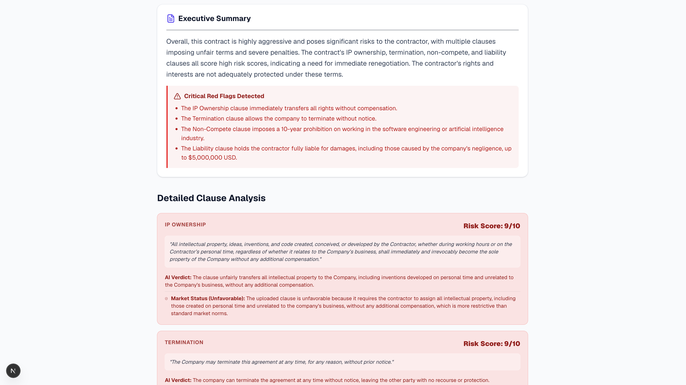

# ⚖️ Legal Document Engine

An AI-powered contract auditing and legal risk analysis platform built using **LangGraph, FastAPI, Qdrant, and Llama 3.3**. The system ingests legal agreements and corporate filings, orchestrates multiple specialized AI agents to analyze contractual language, compares clauses against market standards using vector search, and generates executive-level risk reports.

Designed to demonstrate modern **Agentic AI**, **Retrieval-Augmented Generation (RAG)**, **Multi-Agent Systems**, and **Production-Grade AI Architecture**.



---

## 🚀 Key Features

### 🤖 Multi-Agent AI Workflow

Utilizes LangGraph to coordinate specialized AI agents responsible for:

- Clause Extraction
- Risk Assessment
- Market Benchmarking
- Executive Summarization

Each agent performs a focused task while contributing to a structured end-to-end analysis pipeline.

### ⚠️ Contract Risk Detection

Automatically identifies potentially harmful legal provisions including:

- Broad IP Assignment Clauses
- Uncompensated Non-Compete Agreements
- Excessive Liability Transfers
- Unilateral Termination Rights
- Restrictive Confidentiality Requirements

Each clause receives a severity score and explanation.

### 📊 Semantic Market Benchmarking

Compares contract clauses against a curated repository of market-standard legal language stored inside a Qdrant vector database.

Classifies clauses as:

- Favorable
- Standard
- Unfavorable

while providing supporting benchmark examples.

### 📄 Executive Audit Reports

Generates color-coded legal risk reports featuring:

- Overall Risk Score
- Critical Red Flags
- Clause-Level Analysis
- Benchmark Comparisons
- Executive Summary

### ⚡ Fast Document Processing

Supports analysis of:

- Employment Agreements
- Service Contracts
- NDAs
- Vendor Agreements
- Corporate Filings
- SEC Documents

using PyMuPDF for reliable PDF parsing.

---

## 🏗️ System Architecture

```text
                        ┌────────────────────┐
                        │   PDF Document     │
                        └─────────┬──────────┘
                                  │
                                  ▼
                        ┌────────────────────┐
                        │      PyMuPDF       │
                        │ Text Extraction    │
                        └─────────┬──────────┘
                                  │
                                  ▼
                    ┌──────────────────────────┐
                    │      LangGraph Flow      │
                    └──────────┬───────────────┘
                               │
         ┌────────────────────┼────────────────────┐
         ▼                    ▼                    ▼
 ┌────────────────┐  ┌────────────────┐  ┌────────────────┐
 │ Clause Extract │  │ Risk Scoring   │  │ Clause Compare │
 │     Agent      │  │     Agent      │  │     Agent      │
 └────────────────┘  └────────────────┘  └───────┬────────┘
                                                 │
                                                 ▼
                                       ┌─────────────────┐
                                       │ Qdrant VectorDB │
                                       └─────────────────┘
                                                 │
                                                 ▼
                                       ┌─────────────────┐
                                       │ Summary Agent   │
                                       └────────┬────────┘
                                                │
                                                ▼
                                       ┌─────────────────┐
                                       │ Risk Report PDF │
                                       └─────────────────┘
```

---

## 🧠 AI Pipeline

### 1. Extraction Agent
Responsible for parsing raw legal text, detecting contractual sections, and identifying legal categories (e.g., Confidentiality, Intellectual Property, Liability, Termination).

### 2. Risk Analysis Agent
Evaluates legal language for ambiguity, overreach, and one-sided obligations. Produces a Risk Score (1–10), Risk Explanation, and Severity Level.

### 3. Benchmark Comparison Agent
Generates embeddings for extracted clauses and performs semantic similarity search against Qdrant using Sentence Transformers and Cosine Similarity to output Market Comparison and Favorability Classification.

### 4. Executive Summary Agent
Synthesizes findings into a concise business-friendly report, highlighting High-Risk Clauses and Overall Contract Health.

---

## 🔥 Engineering Highlights

### Multi-Agent Orchestration

Implemented stateful workflows using **LangGraph** to coordinate independent AI agents and maintain shared execution context.

### Retrieval-Augmented Generation (RAG)

Built semantic legal clause retrieval using:

- Sentence Transformers
- Vector Embeddings
- Qdrant Cloud

to ground model responses in real benchmark data.

### Risk Scoring Engine

Designed a structured risk-evaluation framework that converts qualitative legal language into quantitative severity scores.

### High-Performance Inference

Integrated Groq-hosted **Llama 3.3 70B** models to achieve low-latency contract analysis.

### Dynamic Report Generation

Implemented client-side PDF rendering for instant export of complete audit reports.

---

## 🛠️ Tech Stack

### Frontend

- Next.js (App Router)
- React
- Tailwind CSS
- html-to-image
- jsPDF
- Lucide React

### Backend

- FastAPI
- LangGraph
- Groq API (Llama 3.3 70B)
- PyMuPDF

### AI & RAG

- Sentence Transformers (`all-MiniLM-L6-v2`)
- Vector Embeddings
- Semantic Search
- Qdrant Cloud

---

## 🚀 Getting Started

### Prerequisites

- Node.js (v18+)
- Python (3.10+)
- Groq API Key
- Qdrant Cloud Account

### Clone Repository

```bash
git clone https://github.com/YOUR_USERNAME/legal-document-engine.git

cd legal-document-engine
```

### Backend Setup

Create and activate a virtual environment.

### To Run Backend Folder

## Step 1: Activate the virtual environment

source venv/bin/activate

## Step 2: Start the server

python -m uvicorn app.main:app --reload --host 0.0.0.0 --port 8000 --env-file .env

#### Linux / MacOS

```bash
python -m venv backend/venv

source backend/venv/bin/activate
```

#### Windows

```bash
python -m venv backend/venv

backend\venv\Scripts\activate
```

Install dependencies:

```bash
pip install -r backend/requirements.txt
```

Create a `.env` file inside the backend directory:

```env
GROQ_API_KEY=your_groq_api_key

QDRANT_URL=your_qdrant_cluster_url

QDRANT_API_KEY=your_qdrant_api_key
```

Run the FastAPI server:

```bash
python -m uvicorn backend.app.main:app \
--reload \
--host 0.0.0.0 \
--port 8000 \
--env-file backend/.env
```

### Frontend Setup

Open a new terminal window:

```bash
cd frontend

npm install

npm run dev
```

Open:

```text
http://localhost:3000
```

---

## 📁 Project Structure

```text
legal-document-engine/
│
├── frontend/
│   ├── src/
│   │   └── app/
│   │       └── page.tsx
│   └── public/
│
├── backend/
│   ├── app/
│   │   ├── agents/
│   │   │   ├── comparator.py
│   │   │   ├── extractor.py
│   │   │   ├── scorer.py
│   │   │   └── summarizer.py
│   │   ├── utils/
│   │   │   └── pdf_parser.py
│   │   ├── graph.py
│   │   └── main.py
│   ├── scripts/
│   │   └── seed_cuad.py
│   └── requirements.txt
│
├── assets/
│   ├── audit-report.png
│   └── dashboard.png
│
├── .gitignore
├── test_pipeline.py
└── README.md
```

---

## 👨‍💻 Author

### Aman Kumar

Software Engineer | AI Engineer

Focused on:

- Agentic AI Systems
- Retrieval-Augmented Generation (RAG)
- Backend Engineering
- Machine Learning
- Distributed Systems

### Connect With Me

- GitHub: https://github.com/Aman-kumar840
- LinkedIn: https://www.linkedin.com/in/aman-kumar-016927308/

---

⭐ If you found this project useful, consider giving it a star on GitHub.